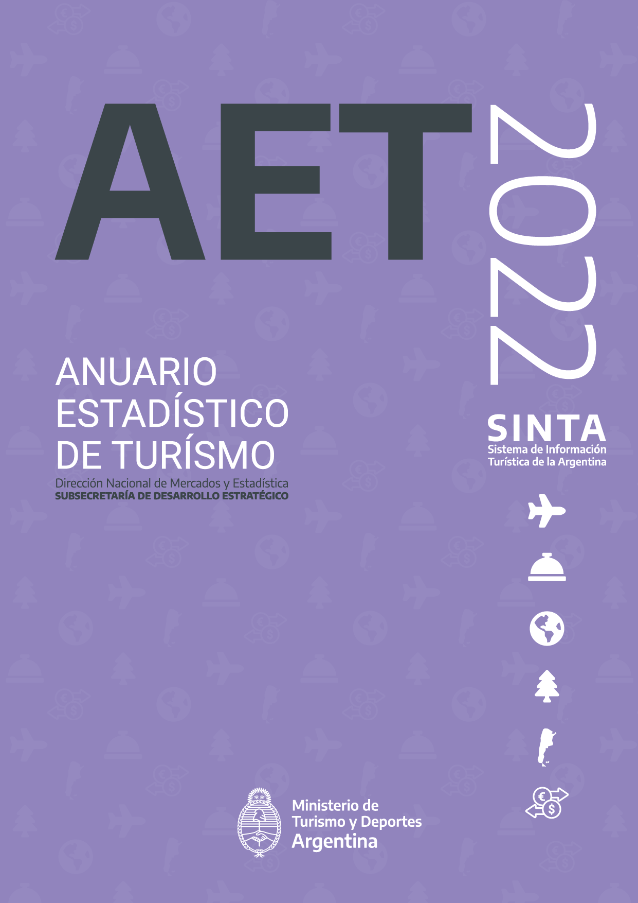

```{r setup, include=FALSE}
knitr::opts_chunk$set(echo = FALSE)
```

La Dirección Nacional de Mercados y Estadística (DNMyE), encargada de la elaboración de la información estadística relativa al turismo en la Argentina, publica el Anuario Estadístico de Turismo 2022. El [AET 2021](https://dnme-minturdep.github.io/anuario_2021/), con el que se retomó la publicación del informe anual estadístico del turismo en Argentina (publicado entre 2005 y 2015), marcó el comienzo de una “segunda época” de este documento por su novedoso formato, completamente reproducible a partir de la difusión del código fuente utilizado en su elaboración. Este recurso fue el que ha permitido la pronta publicación del AET 2022.

```{r ,out.width="50%"}

```

Compuesto por nueve capítulos, el [AET 2022](https://dnme-minturdep.github.io/anuario_2022/) muestra la recuperación del sector luego de afrontar la crisis provocada por la pandemia COVID-19, resultando el 2022 en un año récord en términos de turismo interno. Como muestran el capítulo 1 a nivel mundial y el capítulo 2 para nuestro país, el turismo internacional sufrió una caída mayor y su recuperación demandó un tiempo más prolongado. Sin embargo, para Argentina puede distinguirse el comienzo de la recuperación hacia el final del año 2021. Por su parte, el turismo interno, presentado en el capítulo 3, en 2022 alcanzó el nivel más alto desde por lo menos 2012. El mismo fenómeno se observó en la ocupación hotelera, abordada en el capítulo 4, donde las estimaciones de pernoctaciones de viajeros residentes alcanzaron el máximo valor desde el inicio de su medición en 2004. En el mismo sentido, los capítulos 5 y 6, dedicados a las visitas a parques nacionales y al transporte aéreo, dan cuenta de la reactivación del sector, aunque aún sustentan valores por debajo de la prepandemia. El capítulo 7 cuenta con la información de las agencias de viajes habilitadas en el registro del MINTURDEP. El capítulo 8 resume los principales indicadores económicos del turismo para nuestro país en comparación con otros países de la región. Por último, el capítulo 9 presenta los datos de empleo en el sector hotelero, puestos de trabajo registrados, tasa de feminización y cantidad de empresas en las ramas características del turismo. 

```{r}
library(tidyverse)
library(ggtext)
library(glue)
library(herramientas)
library(comunicacion)
data_serie_turismo_interno <- read_file_srv("/srv/DataDNMYE/imet/serie_evyth.csv")

# DATOS GRAFICO
data_grafico_turismo_interno <- data_serie_turismo_interno %>% 
  filter(!(anio == 2023 & trimestre == 3)) %>% 
  select(anio, tur) %>% 
  group_by(anio) %>% 
  summarise(turistas_anio = sum(tur)) %>% 
  ungroup() 
#mutate(anio = ifelse(anio == 2022,"2022 (1er. trim.)",anio))
data_grafico_turismo_acum <- data_serie_turismo_interno %>% 
 filter(!(anio == 2023 & trimestre == 3)) %>% 
  select(trimestre,anio, tur) %>% 
  filter(trimestre <=  tail(.,1) %>% pull(trimestre)) %>% 
  group_by(anio) %>% 
  summarise(turistas = sum(tur)) %>% 
  ungroup() 
# GRAFICO
grafico_turismo_interno <- data_grafico_turismo_interno %>% 
  #filter(indicador=="turistas") %>% 
  ggplot(aes(x = anio, y = turistas_anio)) + 
  geom_col(fill=dnmye_colores(7),alpha=.5) +
  geom_col(data=data_grafico_turismo_acum,aes(x=anio,y=turistas),width=.7,alpha=1,fill=dnmye_colores(5))+
  # scale_fill_manual(values = c("turistas" = cols_arg, 
  #                              "acum" = dnmye_colores(5)[2])) +
  geom_text(data=data_grafico_turismo_acum,
            aes(x = anio, y = turistas, label = format(round(turistas/1e+6,1),decimal.mark=",",big.mark=".")), color = dnmye_colores(5),
            size = 5,  
            fontface = "bold",
            vjust = -0.25,
            #family = familia_fuente
  ) +
  geom_text(aes(x = anio, y = turistas_anio, label = format(round(turistas_anio/1e+6,1),decimal.mark=",",big.mark=".")), color = dnmye_colores(7),
            size = 5,  
            fontface = "bold",
            vjust = -0.25,
            #family = familia_fuente
  ) +
  theme_minimal() +
  theme(
    #text = element_text(family = familia_fuente), 
    plot.title    = element_markdown(size = 14),
    plot.subtitle = element_markdown(size = 12),
    plot.caption  = element_markdown(size = 12),
    strip.text.y  = element_text(size = 10, face = "bold"),
    axis.text.x   = element_text(size = 10),
    axis.text.y   = element_text(size = 10),
    panel.grid.minor.x = element_blank(),
    legend.position = "none",
    strip.placement = "outside"
  )+
  scale_x_continuous(breaks=c(2012:2023),
                     labels=c(2012:2023))+
  scale_y_continuous(labels = scales::number_format(scale=1/1e+6))+
  coord_cartesian(clip="off")+
  labs(title = "**Turistas internos**",
       subtitle = glue("En millones. Turistas provenientes de grandes aglomerados urbanos. <br> <span style='color:{dnmye_colores(7)}'>Anual</span> y <span style='color:{dnmye_colores(5)}'>1° semestre</span>"),
       caption = "Fuente: DNMyE en base a Encuesta de Viajes y Turismo de los Hogares.",
       x = "", y = "")

grafico_turismo_interno
```


Cada uno de los capítulos cuenta con fichas técnicas y está acompañado del listado de recursos disponibles con los cuales se elaboró. En este sentido, el [Sistema de Información Turística de Argentina](https://www.yvera.tur.ar/sinta/) pone a disposición la gran mayoría de los datos contenidos en el AET, en diversos formatos: datos abiertos, reportes, tableros e informes.

Para la realización del AET, se contó con la participación de toda la DNMyE, que trabajó colaborativamente aprovechando las ventajas de los entornos de control de versiones. Como fuera mencionado, el [código fuente del anuario](https://github.com/dnme-minturdep/anuario_2022) está disponible para su reproducción o actualización futura por parte de la dirección.

Accedé a los recursos de *Anuario Estadístico de Turismo* en:

-   [Anuario Estadístico de Turismo 2022 (AET 2022)](https://dnme-minturdep.github.io/anuario_2022/)
-   [Código fuente del AET 2022](https://github.com/dnme-minturdep/anuario_2022)
-   [Biblioteca: ediciones 2006-2015 y 2021 del AET](https://biblioteca.yvera.tur.ar/)


::: {.infobox}
Para recibir las novedades del SINTA escribíle al bot de Telegram de la DNMyE <a href=‘https://bitacora.yvera.tur.ar/posts/2022-09-08-sintia/’ target=‘_blank’>*SintIA*</a>: <a href=‘https://t.me/RDatinaBot’ target=‘_blank’>@RDatinaBot</a> 🤖
:::

